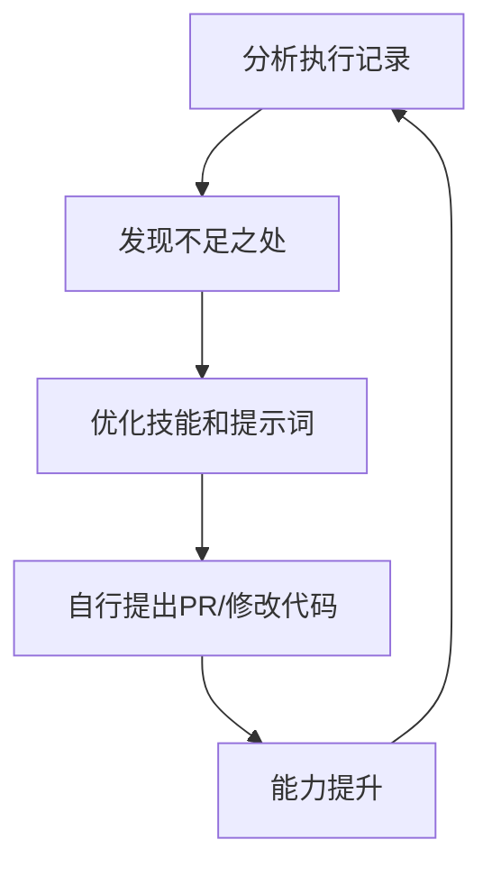

## 二、BRA 记忆同步系统（16.4K ⭐）

### 核心功能
实现**多设备上下文共享**

### 工作机制
```
公司电脑 ──┐
           ├──→ 同一段记忆 ←── 跨设备同步
家里笔记本 ──┤
手机 ──────┘
```

### 效果
- 在公司教给 Hermes 的知识，回家自动记得
- 无需复制粘贴上下文
- 三台设备使用同一套对话历史和记忆

---

## 三、Hermes Web UI（7.5K ⭐）

### 核心功能
为 Hermes 提供**网页图形界面**

### 对比

| 终端模式 | Web UI模式 |
|---------|-----------|
| 纯黑窗口命令行 | 可视化图形界面 |
| 只能打字 | 支持管理、绘画、查看文件 |
| 功能受限 | 与 GPT 网页版体验一致 |

### 适用场景
习惯图形界面操作、不熟悉命令行的用户。

---

## 四、Auna G 资源导航库（3.1K ⭐）

### 核心功能
**Hermes 生态的雷达站**

包含内容：
- 社区最新插件
- 新工具发布
- 教程更新
- 生态动态

### 价值
Hermes 生态每天都在更新，安装此 Skill 可第一时间获取最新资源，不错过任何新功能。

---

## 五、Hermes Self-Evolution（3.3K ⭐）

### 核心功能
**自净化/自进化系统**

### 工作流程



### 特点
- 自动分析自身执行记录
- 发现问题后自行优化
- 可以给自己提 Pull Request 修改代码
- 越用越聪明，而非出厂即巅峰

---

## 安装方法

通过飞书与 Hermes 对话，发送以下指令：

```
帮我安装这5个skills
```

Hermes 将自动完成所有 Skill 的安装配置。

---

## 总结

| Skill名称 | 星数 | 核心价值 |
|----------|------|---------|
| JTY CEO | 97 ⭐ | 专业技能包（代码审查、安全审计等） |
| BRA 记忆同步 | 16.4K ⭐ | 多设备上下文共享 |
| Web UI | 7.5K ⭐ | 图形化界面 |
| Auna G | 3.1K ⭐ | 生态资源导航 |
| Self-Evolution | 3.3K ⭐ | 自进化优化 |